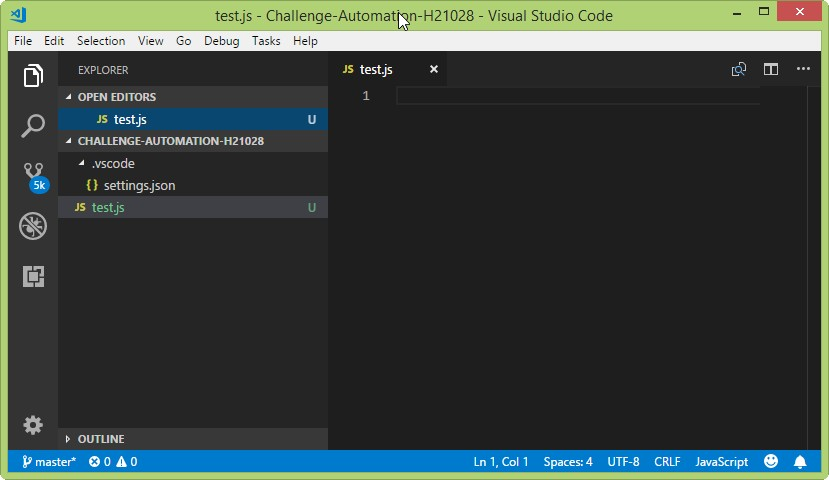
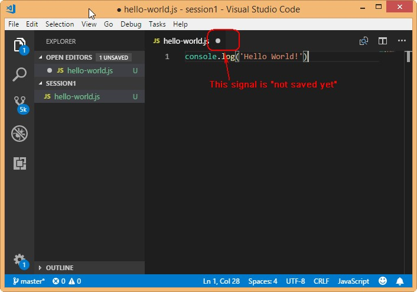
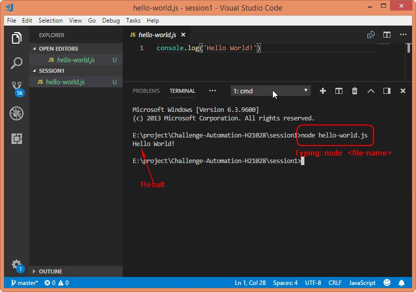

# [Content of challenge](https://github.dev.cybozu.co.jp/pages/t000602/qavn-challenge-2nd-2018/)

//section 1:
# Install the necessary software/packages

[1] Install nodejs <br>
Based on your OS (Windows, Mac OS, Linux/Unix), let [download](https://nodejs.org/en/) </br>
Check install successfully or not by run command

        $ C:\Users\hoa-nguyen.CB>node -v
        v8.11.3

        $ C:\Users\hoa-nguyen.CB>npm -v
        5.6.0


[2] Install IDE </br>
In this session, we will use "Visual Studio Code" </br> 
Based on your OS (Windows, Mac OS, Linux/Unix), let [download at here](https://code.visualstudio.com/) </br>
Target:support in writing code/programming </br>

# Quick Start

1. Create a folder e.g Challenge-Automation-H21028
2. Create a new file e.g test.js

        $ cd e:\project
        $ e:
        # mkdir Challenge-Automation-H21028
        # touch test.js

3. Open test.js by "Visual Studio Code" </br>


//section 2

# Nodejs

## Pratice with hello-world.js

1. Open "Visual Studio Code"
2. Open File > New Folder (e.g folder name is "session1")
3. Cliking no "New Folder" then [Open File > New File]
4. Save as with name "hello-world.js"

```
    console.log("Hello World!");
```


5. Open File > Save 
Using hot key Ctrl+S for save

6. Open View > Intergated Terminal
7. Run js file by the node <file-name\> on the intergated terminal



    Hint
        Set auto save file on Visual Studio Code
        File > Auto Save


