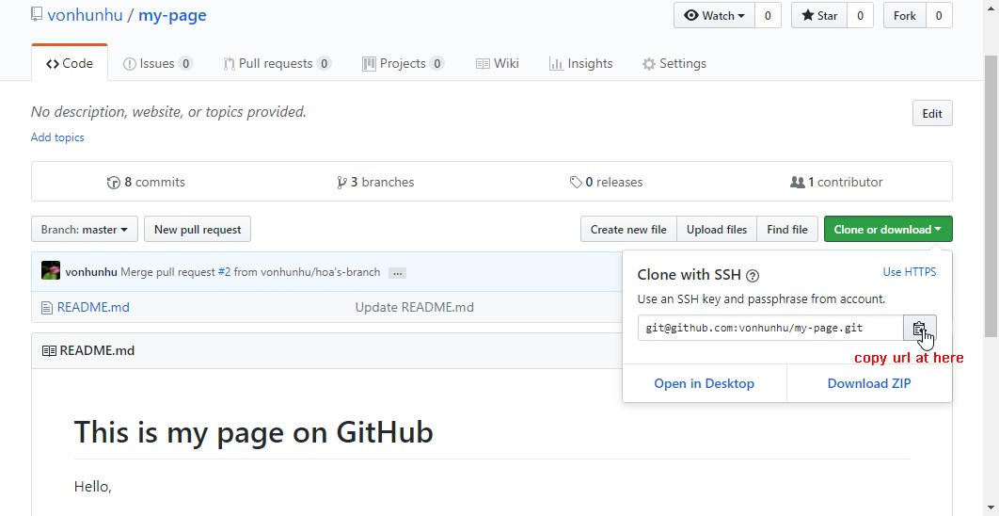

# Overview

GitHub is a code hosting platform for version control and collaboration. It lets you and others work together on projects from anywhere.

GitHub essentials like repositories, branches, commits, and Pull Requests. 

Pull Requests are the heart of collaboration on GitHub. When you open a pull request, you’re proposing your changes and requesting that someone review and pull in your contribution and merge them into their branch. 

These are 2 types:  
1. Github Global    
    **https://github.com**  
2. Github Enterprise  
    **e.g https://github.dev.cybozu.co.jp**  

# A. Installation

1. Install github
Based on your OS (Windows, Mac OS, Linux/Unix), let [download](https://git-scm.com/download) the suitable archive

2. Create a GitHub account  
 ->Send request to IT support to create the new account if you're using Github Enterprise  
 ->For personal account, you can create by yourself 

# B. Operation with GibHub in Basic
**Taget: get the latest version on local ** 
UsingTerminal in Mac or Command Prompt or Powershell in Windows.

## 1. Initializing a Repository on local

    $ cd e:/project/github-project
    $ git init
    Initialized empty Git repository in E:/project/github-project/.git/

Result: creates a new subdirectory named .git that contains all of your necessary repository files

## 2. Cloning an Existing Repository
* Clones=copy a repository into a newly created directory, creates remote-tracking branches for each branch in the cloned repository, run by command git clone <url\>
* <url\> get from git server

* Result: the new source has your local.

        $ cd e:/project/github-project
        $ git clone git@github.com:vonhunhu/github-project.git

## 3. git checkout
* Switch branches or restore working tree files, run by command git checkout <branch-name\> by open the terminal 
* Result: get a staging of snapshop on the specify branch

        $ cd e:/project/github-project
        $ git chechout github-project

## 4. git pull
* Fetch and replay the changes from the remote, run by command git pull <branch-name\>
* Result: get a lasted version from github

        $ cd e:/project/github-project/<branch-name>
        $ git chechout <branch-name>
        $ git pull <branch-name>

## 5. git status
* To know the file status, by run the git status command

        e.g created a myfile.md into your repository by command $ touch myfile.md
        $ git status
        On branch master

        No commits yet

        Untracked files:
        (use "git add <file>..." to include in what will be committed)

        myfile.md

        Nothing added to commit but untracked files present (use "git add" to track)

## C. [GibHub Operation on Web UI](https://guides.github.com/activities/hello-world/)

## D. [GitHub Desktop Operation](https://help.github.com/desktop-classic/guides/getting-started/)

## E. [GibHub Guide in Vietnamese](http://rogerdudler.github.io/git-guide/index.vi.html)

## F. [GibHub in advance](https://git-scm.com/book/en/v2)